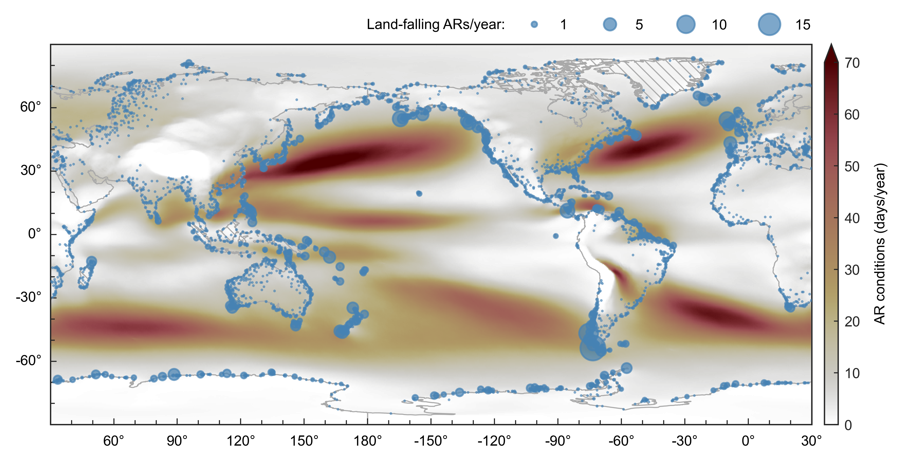

# Vallejo-Bernal & Braun et al. (2025)
The PIKART catalog covers atmospheric rivers globally from 1940 to 2023 at 0.5° resolution and 6-hour temporal resolution.

This repository contains all Python scripts that you need to reproduce the key results and figures from the paper it has been introduced with:

**Vallejo-Bernal, S. M., Braun, T., Marwan, N., & Kurths, J. (2025)**  
*PIKART: A Comprehensive Global Catalog of Atmospheric Rivers*  
*Journal of Geophysical Research: Atmospheres*, **130**(15), e2024JD041869.
DOI: **10.1029/2024JD041869** 


This repository does **not** provide the scripts to generate the catalog itself. These can be found [here](https://gitlab.pik-potsdam.de/PIKART/pikart_v1).

## Quick Start

1. **Set up a Python environment**  
All analyses were carried out in **Python 3.12.2**. The required packages are listed in *requirements.txt*.

You can set up a Python environment:

```bash
python3 -m venv env
source env/bin/activate
pip install -r requirements.txt
```

or a conda environment:

```bash
conda env create -f environment.yml
conda activate pikart_env
```


2. **Download data**  

Download both the Lagrangian and Eulerian version of the PIKART catalog [here](http://ar.pik-potsdam.de/).

Additional data that has been used in the manscrupt is listed here:
| Dataset                 | Usage                                                                                                                              |
| ---------------------- | ------------------------------------------------------------------------------------------------------------------------------------ |
| `PIKART Eulerian & Lagrangian catalog`             | Required for all analyses and figures. Download [here](http://ar.pik-potsdam.de/). |
| `ERA-5 IVT data`             | Required for creating the animation (and building the catalog). Download source data [here](https://cds.climate.copernicus.eu/). |
| `ARconnect (Shearer et al., 2020)`             | Required for comparison in Fig. 7. Download [here](https://doi.org/10.6075/J0D21W00). |
| `IPART-1 (Xu,Ma,& Chang, 2020)`             | Required for comparison in Fig. 7. Download [here](https://doi.org/10.5281/zenodo.3864592). |
| `tARget-4 (Guan & Waliser, 2024)`             | Required for comparison in Fig. 7. Download [here](https://dataverse.ucla.edu/dataverse/ar). |
| `shape-file for continents`             | Required for spatial maps and normalization in AR rank analysis. Provided in the world_continents directory.|


Place the required input files into the folders that you specify in the **config_PIKART.yml**-file. Alternatively, the paths can also be hard-coded into each analysis/plotting script individually. 

3. **Run analysis**  

All python scripts that produce results from the manuscript are stored in the *analysis* folder. Below, the scripts that implement the main analysis are listed:

| Script                 | Purpose                                                                                                                              |
| ---------------------- | ------------------------------------------------------------------------------------------------------------------------------------ |
| `merge_csv_files.py`             | compiles a reduced version of the PIKART lagrangian catalog, containing the full period from 1940 to 2023, but only the variables necessary for the analysis presented in the manuscript. |
| `analysis_figure7.py`     | Computes statistics for different catalogs as displayed in Fig. 7 (expecting adequate data input!).                           |
| `analysis_figure8.py` | Computes spatial histograms as displayed in Fig. 8.                                 |
| `analysis_figure9-10.py`       | Builds rank histograms displayed in Figs. 9 and 10 from chunked Eulerian catalog (parallelised, run on performant computer). |
| `merge_figures9-10.py`       | Merges the longitudinal chunks and generates the input data for Figs. 9 and 10. |
| `analysis_figure11.py`       | Performs lifecycle analysis and computes spatial histogram of inland penetrating ARs as displayed in Fig.11.                                      |
| `analysis_figure12-1.py`       | Builds aggregated time series for trend analysis displayed in Fig.12 from chunked Eulerian catalog (parallelised, run on performant computer).                                      |
| `analysis_figure12-2.py`       | Carries out the trend analysis displayed in Fig.12. |
| `analysis_functions.py`             | Stores all subroutines needed in the other scripts. |
| `submit_analysis_figures9-10.sh`             | Example bash script (Figs. 9/10), used to submit jobs to HPC. |


4. **Reproduce figures**  

All python scripts that plot results from the manuscript as main or supplementary figures are stored in the *figures* folder. They follow the same logic and build on the output data generated by the analyses scripts.




## Support
If you find any issues, please feel free to use the 'raise issue' function or [contact us](mailto:vallejo.bernal@pik-potsdam.de,tobraun@pik-potsdam.de,marwan@pik-potsdam.de) directly.

## Further information
More detailed information on the PIKART algorithm and the used AR identification and tracking algorithms can also be found on [our website](http://ar.pik-potsdam.de/).

## License
The PIKART Atmospheric River Catalog is licensed under the Creative Commons Attribution-NonCommercial 4.0 International License (CC BY-NC 4.0). You are free to share, use, and adapt the data for non-commercial purposes. Please give appropriate credit by citing the manuscript. Commercial use requires prior permission – please [contact us](mailto:vallejo.bernal@pik-potsdam.de,tobraun@pik-potsdam.de,marwan@pik-potsdam.de).

## Authors and acknowledgment
The PIKART catalog was developed at the Potsdam Institute for Climate Impact Research (PIK) with contributions from various researchers and developers.

We gratefully acknowledge support from the German Federal Ministry of Education and Research (BMBF) through the climXtreme project [01LP1902J], the Saxon State Ministry for Science, Culture and Tourism (SMWK) as part of the Breathing Nature initiative at Leipzig University [3‐7304/35/6‐2021/48880], and the European Space Agency (ESA) Living Planet Fellowship through the ARNETLAB project [4000144018/24/I-DT-lr].

Special thanks to all contributors who have provided feedback, reported issues, and helped improve the dataset.


